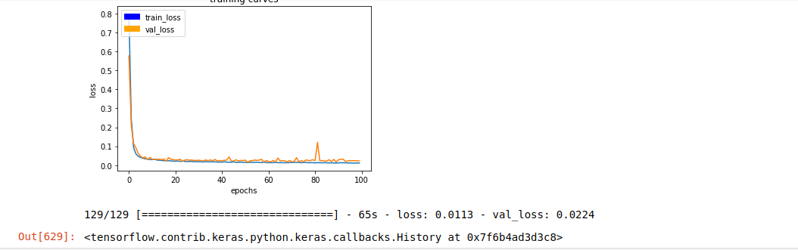
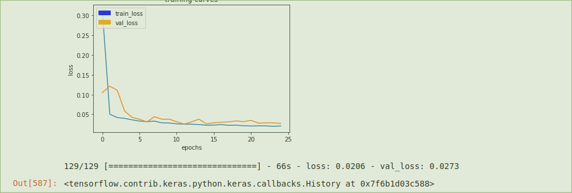

## Follow Me Deep Learning Project ##

### Goal

The goal of this project is to create and train a Fully Convolutional Network for semantic segmentation.  The camera images from a virtual drone will be segmented into background, other people, and hero.  The hero is the target for the drone to follow.

### Network Architecture

At a high level, the network used comprises an _encoder_ section that extracts feature information from the image using convolutions at decreasing resolution and increasing filter depth, a 1x1 convolution layer, and a _decoder_ section that progressively increases resolution while decreasing filter depth.  Often, a pre-trained classifier is used for the initial layers; in this case an untrained 3 layer classifier is used.  Dropout is added on two layers to make the network more robust as well as to reduce overfitting.  The upscaling decoder layers have skip connections to the higher resolution encoder outputs.  This brings in spatial information that appears to be very important for correctly scaling back up to image resolution from the quite low final encoder convolution output.

Per the lesson lab, the network is composed series of separable 2D convolution layers utilizing batch normalization at each layer.  These _encoder_ layers use kernel size 3, _relu_ activation, and a stride of 2 with _same_ padding to yield an output dimension ratio of 0.5 on each axis.  Separable convolution layers are used to reduce the number of parameters in the network.  Following the convolutions, a 1x1 convolution layer is added.  Whereas a typical classifier would use fully connected layer(s) here to generate a translation invariant estimate of the class present in the scene, the 1x1 convolution preserves spatial information at the resolution of the final encoder layer.  The following layers each upsample by 2x on each axis using bilinear upsampling.  The number of these layers matches the number of encoder convolution layers, so the final resolution matches that of the input.  Each of these layers also takes as input the output of its matched resolution encoder layer and concatenates this with the upsampled input.  This skip input brings higher resolution information.  Finally, each decoder layer uses a separable convolution with stride 1 to produce its result.  The final network output is a 2D convolution with _softmax_ activation.  Softmax applied here produces a pixel-level classification of the image.

Following is the network architecture:

| Layer | Type | Kernel | Stride | Filters |
| ----- | ---- | ------ | ------ | ------- |
| 1     | separable conv 2D relu | 3x3 | 2 | 32 |
| 2     | separable conv 2D relu | 3x3 | 2 | 128 |
| 2d    | dropout 0.5 |  |  |  |
| 3     | separable conv 2D relu | 3x3 | 2 | 512 |
| 3d    | dropout 0.5 |  |  |  |
| 4     | conv 2D relu | 1x1 | 1 | 1024 |
| 5     | decoder | 3x3 | 1 | 256 |
| 6     | decoder | 3x3 | 1 | 64 |
| 7     | decoder | 3x3 | 1 | 16 |
| out   | conv 2D softmax | 3x3 | 1 | 3  |

Following is the structure of the decoder layer:

| Decoder Layer | Type |
| ------------- | ---- |
| 1 | bilinear upsample 2x |
| 2 | concat |
| 3 | conv 2D relu 3x3 stride 1 |

### Tuning

Hyperparameters and network structure were selected by trial and error.  Batch size was constrained by GPU memory and several values were compared.  There was no clear effect on final score but 32 seemed to be a good spot with regard to training speed.  Learning rate as high as 0.05 produced good initial results, but lowering the rate did reduce some tendency of the validation loss to spike during training (especially using my training data instead of Udacity's).  My understanding is that the this parameter is also adjusted internally in the Adam optimizer.  Overall, 0.005 and lower values seemed like a better bet.  Number of epochs produce sharply diminishing returns in training loss but may eventually produce a better network.  As discussed below, I found it very hard to determine from the training and validation loss curves whether running more epochs would actualy be helpful.

Tuning this network was a frustrating process.  The initial 3 layer lab design scored 0.415 with a high learning rate of 0.05.  I then tried deeper networks and an extra convolution in the decoder layers.  I also captured training data, and tested this, hoping to improve on the results at long range.  Many attempts later, I achieved roughly parity of my training data with the Udacity training data at 0.37 - 0.38.  Even after reducing the network back to 3 layers multiple runs were needed before I got to 0.416, and in that case I had lowered the learning rate considerably, to 0.003.

Generally, sweeping the learning rate made the training validation loss smoother but failed to yield a good result.  While the poor generalization suggests overfitting, the final loss remained well above zero.  I tried smaller networks with dropout, and finally added a second dropout layer.  At this point I decided to heed a comment in the lecture that if dropout doesn't work for you, you probably need more parameters.  While I had used similar filter counts previously, I had less dropout at that time.  Increasing the network size _and_ using two dropout layers finally started to produce some positive effect.  I then started a longer run (100 epochs) with low learning rate (0.001).  This came back with 0.4677.  Hopefully enough to pass the 0.40 requirement.

It should be noted that the training loss curves rather poorly predict the testing result.  Many times I had smooth curves and low loss in the 0.02 to 0.03 range but final scores of .25 - .39.  The final long, low learning rate training made a small improvement in the loss, but the eventual gains would have been hard to predict given prior attempts.

### Cat Dog Car!?

Would this model work well for following another object like a dog, cat, or car?  Not likely.  The network could be trained using appropriate data and would probably work fine but as-trained, this network wouldn't know how to tell a dog from a cat or a person.  It could be that one of these object is sufficiently differentiable from the background, but this would be luck.  A more interesting question is, could the network be trained to classify dogs, cats, people, and cars?  It might work, but given the low accuracy differentiating a red person from not-red people, I think the network probably needs a bit more complexity to do a good job differentiating multiple similar classes.

### Discussion

Convolutional networks capture, from layer to layer, features of increasing complexity, from simple line and curve segments to more complex but abstract, and finally to recognizable components (of a face or a vehicle for example).  Once the encoder layers recognize an adequate set of features, the remaining layers can compose these component features to detect an item of interest, like a person or a hero.  People and the hero can then be segmented from the rest of the image, enabling the drone in this project to follow the hero.  To my eye, the hero is primarily just a red person.  Without such a clear differentiating attribute, following a specific person would be a much harder problem.

### Future Enhancements

The encoder needs much more training data to learn complex feature components.  Using the initial layers of a pretrained classifier should be considered.  This would provide a much richer set of inputs for subsequent layers to use for this specific application.

